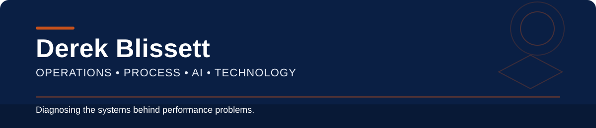

  
  
  
  

I’ve spent my career leading and improving customer and business operations, usually by figuring out where performance is actually breaking down.

Sometimes the process is unclear. A handoff is broken. Ownership is missing. The technology creates more work than it removes. Or the team is being asked to fix a problem that actually sits somewhere else in the system.

That is what pulled me deeper into technology.

I’m not learning AI, Python, AWS, and automation because I want to become a traditional software developer. I want to understand these tools well enough to know what they can actually do, where they create value, and how they should fit into the operation around them.

> **Where is performance actually breaking down?**  
> Before adding another tool, automation, dashboard, or AI solution, I want to understand the process underneath the problem.

---

## Selected Work

### 🤖 AI Operations Diagnosis Agent

A browser-based AI application built to help operations leaders turn messy operational problems into structured root-cause analysis.

Using my **Layered Thinking** approach, the application separates:

**Visible Symptoms → Root Causes → Structural/System Issues → Recommended Actions**

  
  
  

[View project](https://github.com/KingAdamas/ai-operations-diagnosis-agent) · [Live demo](https://ai-operations-diagnosis-agent.streamlit.app/)

### 🌐 Client Website & Creator Platform

A client-facing platform I planned, developed, deployed, and continue to manage. I use GitHub Issues and Projects to manage features, fixes, priorities, and ongoing improvements after launch.

  
  
  
  

[View project](https://github.com/KingAdamas/reddiamonds-site) · [Live site](https://www.reddiamondsinternational.com)

### ☁️ AWS EC2 Portfolio Deployment

A hands-on cloud operations project demonstrating secure deployment and lifecycle management of a Linux web server, including network access, documentation, teardown, and cost control.

  
  
  

[View project](https://github.com/KingAdamas/aws-ec2-portfolio-demo)

---

## How I Think About Technology

I believe technology can make organizations faster, more efficient, and more capable. But technology does not operate independently from the people and systems around it.

AI does not fix a broken process simply because it has been implemented. Automation does not solve unclear ownership. A new platform does not eliminate bad handoffs. Better data does not automatically produce better decisions.

The process still matters. The people using the technology still matter. Leadership, policies, guardrails, training, ownership, and accountability still matter.

That is why I am learning the technical side myself. I want to understand what these tools can actually do, where they create value, and when technology is being asked to solve what is really a **process, leadership, people, or system-design problem**.

> **Technology is part of the operating system. It is not the operating system by itself.**

---

## Where I Work Best

| Operations & Execution | AI & Automation | Development & Cloud |
| --- | --- | --- |
| Project Management | AI Agents | Python |
| Process Improvement | Prompt Design | Streamlit |
| Root-Cause Analysis | Workflow Automation | APIs |
| Workflow Optimization | AI-Enabled Operations | AWS / EC2 |
| Service Delivery | Decision Support | GitHub / Copilot |
| Vendor Governance | Human-in-the-Loop Design | Next.js |

---

  <strong>The goal is to understand technology well enough to know when, where, and how it should be used.</strong>

<strong>Building where operations meets technology.</strong>

